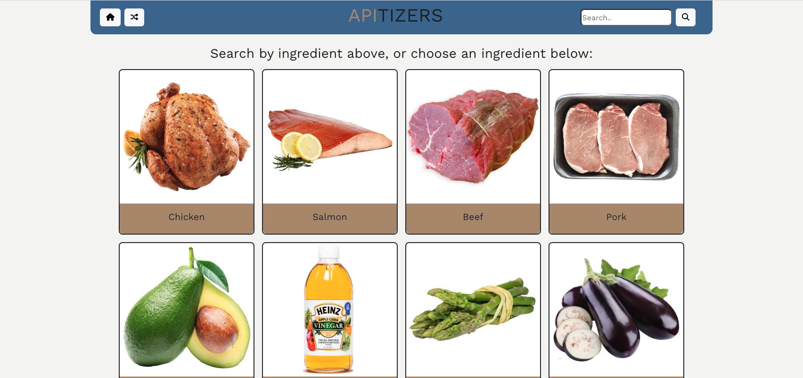
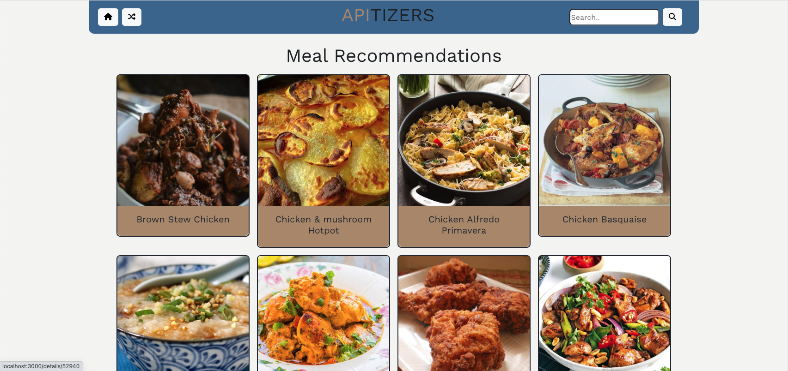
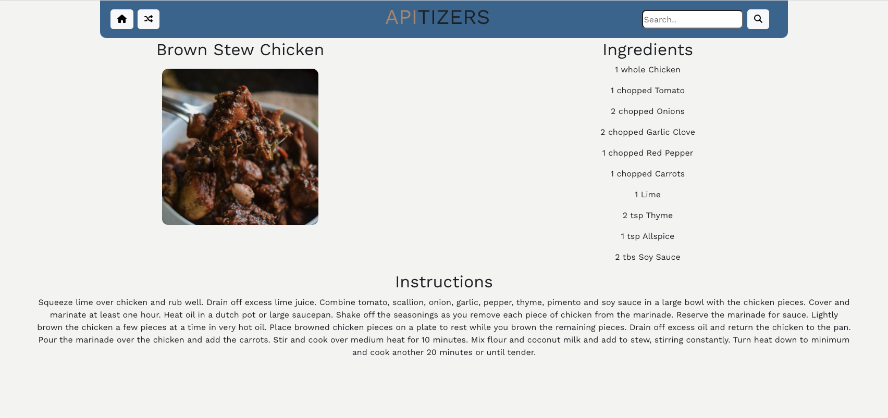
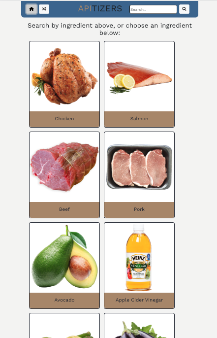
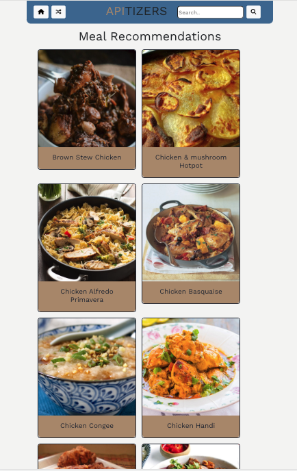
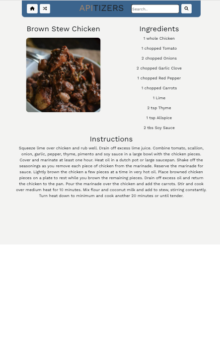

# Project Description:

[APItizers](https://api-tizers.netlify.app/) is a meal recommendation app for those days when you don't know what to eat. 

Users can search by ingredient, or click on one of the many ingredients displayed on the home page, and they will get a list of meal recommendations. From there, they can click on a meal to get the recipe and preparation instructions.

 

# Screenshots:

### Desktop Screenshot:

### Mobile Screenshot:

 

# Technologies Used

- React.js
- Node.js
- JSX
- HTML
- CSS

 

# Getting Started/Installation Instructions:

Using APItizers is easy: simply load the <a href="https://api-tizers.netlify.app/" target="_blank" rel="noopener noreferrer">deployed page</a> and begin your search. 

To access the code and make contributions:

- Fork and clone this repository.
- Change into the new directory.
- Install dependencies (npm i or npm install).
- Open up your app in VS Code (code .)
- Run npm start to start your local server.

 

# Future Features/Improvements:

- Ability to favorite meals.
- Combine a second API to display wine pairings for each meal.

 

# Bugs? Suggestions? Contributions?

Contact us:

- Chris Bowman: [chrisb0wman@hotmail.com](mailto:jordan.bortner@gmail.com)
- John Goodrich: [jbgoodrich26@gmail.com](mailto:Maryrodri3210@gmail.com)
- Luigi Bustos: [LouisAlphonsoBustos@gmail.com](mailto:LouisAlphonsoBustos@gmail.com)
- Natalie Perez [natalieperez84@gmail.com](mailto:natalieperez84@gmail.com)

